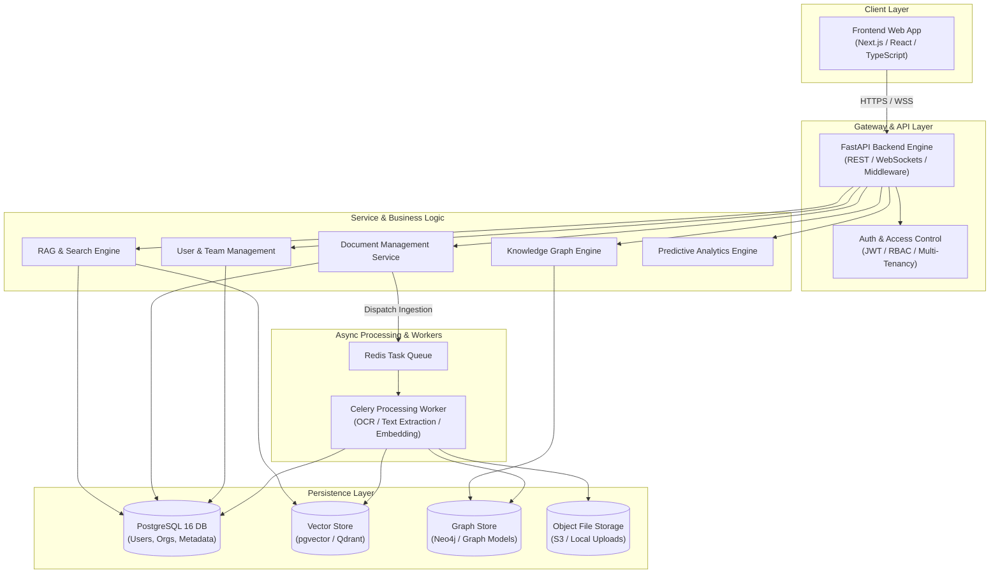

# KEEP — Technical Architecture (ARCHITECTURE.md)

> **Master Architecture Specification for KEEP (Knowledge Extraction & Enterprise Platform)**  
> *Derived from official `devdocs/` Phase 0–3 specifications.*

---

## 1. Project Overview

**KEEP (Knowledge Extraction & Enterprise Platform)** is an enterprise-grade, AI-powered knowledge management and decision-support ecosystem. It transforms fragmented organizational data—documents, user interactions, projects, departments, policies, and communication logs—into an interconnected semantic network. 

Beyond standard keyword search or basic Retrieval-Augmented Generation (RAG), KEEP integrates:
- **Intelligent Document Processing & Ingestion**: Multimodal OCR, metadata enrichment, and chunking.
- **Hybrid RAG & Semantic Search**: Vector similarity combined with BM25 keyword search and reranking.
- **Enterprise Knowledge Graph**: Entity extraction, relationship mapping, and semantic graph queries.
- **Predictive Analytics & Intelligence**: Anomaly detection, trend forecasting, and executive dashboards.
- **Enterprise Connectors**: Integrations with cloud storage, project management tools, and communication suites.
- **Zero-Trust Security & Compliance**: Multi-tenant isolation, Role-Based Access Control (RBAC), and detailed audit logs.

---

## 2. System Goals

1. **Unify Enterprise Knowledge**: Single source of truth for unstructured and structured data.
2. **Context-Aware AI Assistance**: Hallucinated-free, citation-backed answers utilizing company knowledge.
3. **Deep Relationship Discovery**: Discover hidden links between projects, people, departments, and documents.
4. **Scalability & High Availability**: Cloud-native, containerized monorepo handling thousands of concurrent users and millions of knowledge objects.
5. **Strict Governance & Multi-Tenancy**: Data isolation across organizations and teams with strict RBAC enforcement.

---

## 3. Official Technology Stack

| Layer | Technology | Version / Specifications |
| :--- | :--- | :--- |
| **Frontend Framework** | React / Next.js / TypeScript | Node.js 22 LTS, TypeScript 5+ |
| **UI & Styling** | Tailwind CSS | Modern responsive design system |
| **Frontend State** | Zustand / Redux Toolkit | Centralized state management |
| **Backend Framework** | FastAPI (Python) | Python 3.12+, Pydantic v2 |
| **ORM & Persistence** | SQLAlchemy 2.0 + Alembic | Repository & Unit-of-Work patterns |
| **Primary Database** | PostgreSQL | Version 16 (Relational & Multi-tenant) |
| **Vector DB / Search** | pgvector / Qdrant / Chroma | Hybrid semantic & keyword indexing |
| **Graph Database** | PostgreSQL (MVP) -> Neo4j | Knowledge graph entity & relationship store |
| **Caching & Messaging**| Redis | Task queue broker, session storage & response caching |
| **Background Workers** | Celery / Taskiq | Asynchronous ingestion & OCR background tasks |
| **AI / ML Frameworks** | LangChain / LlamaIndex | LLM orchestration & RAG pipelines |
| **Embedding Models** | SentenceTransformers / OpenAI | High-dimensional semantic embeddings |
| **Containerization** | Docker & Docker Compose | Containerized local & production execution |
| **CI/CD & Automation** | GitHub Actions | Automated lint, type check, test & build workflows |
| **Testing Suite** | Pytest, Playwright, Jest | Unit, Integration, E2E, and Browser testing |

---

## 4. High-Level System Architecture

---

## 5. Component Responsibilities

### 5.1 Frontend (`/frontend`) — Owner: Agent 2
- Renders responsive, modern UI components for Dashboard, Document Management, Search, Workspace Collaboration, and AI Chat Assistant.
- Consumes Backend REST endpoints and WebSocket feeds.
- Manages client-side authentication tokens, navigation, and application state.

### 5.2 Backend API & Core Services (`/backend/app`) — Owner: Agent 1
- **API Routers (`app/api/v1`)**: Exposes RESTful endpoints for Auth, Users, Organizations, Documents, Search, Chat, and Analytics.
- **Middleware & Security**: Enforces JWT verification, CORS, rate limiting, and RBAC permissions.
- **RAG Engine & AI Assistant (`app/services/rag`)**: Orchestrates vector search, BM25 hybrid ranking, context assembly, and LLM prompt generation with citation tracking.

### 5.3 Database, Data & Ingestion (`/backend/app/models`, `/backend/app/services/ingestion`) — Owner: Agent 3
- **SQLAlchemy ORM & Alembic Migrations**: Maintains database schemas, multi-tenant organization models, document metadata, audit trails.
- **Ingestion Pipeline**: Parses PDF, DOCX, TXT, images via Tesseract OCR, performs chunking, generates embeddings, writes to Vector DB.
- **Knowledge Graph Service**: Extracts entities and relationships, populates graph representations for connected semantic navigation.

### 5.4 DevOps, Infrastructure & QA (`/infrastructure`, `/docker`, `/tests`) — Owner: Agent 4
- Maintains `docker-compose.yml`, Dockerfiles, and local dev environments.
- Manages GitHub Actions CI/CD pipelines (`.github/workflows/ci.yml`).
- Orchestrates cross-component integration testing, Pytest suites, and Playwright browser verification scripts.

---

## 6. Data Flow Architecture

### 6.1 Document Ingestion Flow
1. User uploads document via Frontend -> Backend `/api/v1/documents/upload`.
2. File saved to File Storage; metadata saved to PostgreSQL.
3. Asynchronous job dispatched to Redis queue.
4. Worker parses document, performs OCR if needed, cleans text, and splits into semantic chunks.
5. Embedding model generates vectors for chunks.
6. Vectors saved to Vector Database; entity triples extracted for Knowledge Graph.
7. Document status updated to `PROCESSED`.

### 6.2 RAG Query & Search Flow
1. User submits query via AI Assistant UI -> Backend `/api/v1/chat/query`.
2. Backend generates query embedding and executes hybrid search (Semantic Vector Search + BM25 Keyword Search).
3. Reranker selects top $K$ relevant document chunks.
4. RAG engine formats prompt with retrieved context + strict system instructions.
5. LLM generates answer with direct source citations (`[Doc X, Page Y]`).
6. Response streamed back to Frontend.

---

## 7. Authentication, Governance & Multi-Tenancy

- **Authentication**: OAuth2 with Password Grant, JWT access tokens, refresh tokens.
- **Multi-Tenancy**: Organization ID present on all database entities and vector payloads. Queries strictly filter by `organization_id`.
- **Role-Based Access Control (RBAC)**:
  - Roles: `SuperAdmin`, `OrgAdmin`, `Manager`, `Member`, `Guest`.
  - Granular resource permissions defined at API router and service levels.

---

## 8. Testing Architecture

- **Unit Tests (`tests/unit/`)**: Tests individual functions, Pydantic schemas, isolated services, and React components.
- **Integration Tests (`tests/integration/`)**: Tests API endpoints against PostgreSQL test container, DB transaction rollbacks, and ingestion worker pipelines.
- **End-to-End Tests (`tests/e2e/`)**: Playwright automated browser tests validating user authentication, file upload, search, and AI chat flows.

---

## 9. Four-Agent Ownership Matrix

| Repository Domain | Primary Agent Owner | Secondary Agent Owner | Key Responsibility |
| :--- | :--- | :--- | :--- |
| `/backend/app/api`, `/backend/app/services/rag` | **Agent 1** (Backend/AI) | Agent 4 (DevOps) | FastAPI core, Auth, RAG engine, REST APIs |
| `/frontend` | **Agent 2** (Frontend) | Agent 4 (DevOps) | React/Next.js UI, Tailwind, Zustand, Pages |
| `/backend/app/models`, `/backend/app/services/ingestion` | **Agent 3** (Database/Ingestion) | Agent 1 (Backend) | PostgreSQL models, Alembic, OCR, Vector DB, Graph DB |
| `/infrastructure`, `/docker`, `.github`, `/tests` | **Agent 4** (DevOps/QA) | All Agents | CI/CD, Docker, E2E testing, Browser verification |
