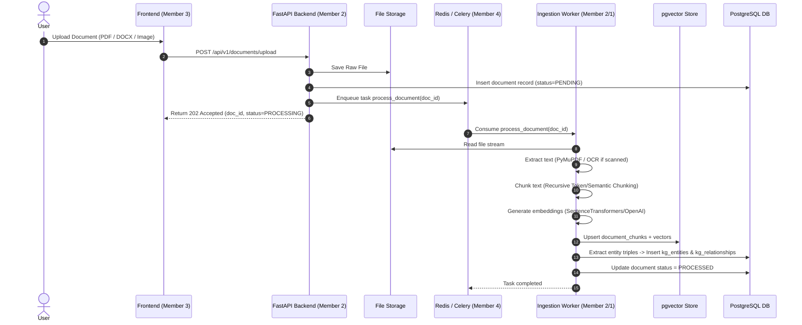
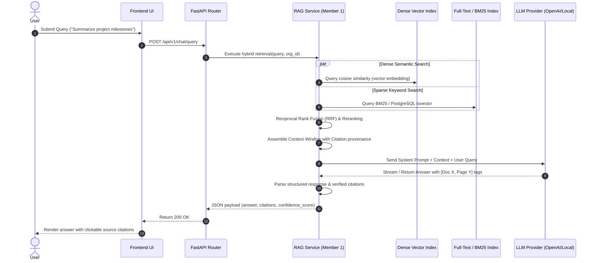

# KEEP — Technical Architecture (ARCHITECTURE.md)

> **Master Architecture Specification for KEEP (Knowledge Extraction & Enterprise Platform)**  
> *Derived from official `devdocs/` Phase 0–3 specifications.*

---

## 1. Project Overview

**KEEP (Knowledge Extraction & Enterprise Platform)** is an enterprise-grade, AI-powered knowledge management, semantic discovery, and decision-support ecosystem. It transforms fragmented organizational data—documents, user interactions, projects, departments, policies, and communication logs—into an interconnected semantic network. 

Beyond standard keyword search or basic Retrieval-Augmented Generation (RAG), KEEP integrates:
- **Intelligent Document Processing & Ingestion**: Multimodal OCR, metadata extraction, structural analysis, and chunking.
- **Hybrid RAG & Semantic Search**: Vector similarity (dense retrieval) combined with BM25 (sparse keyword search) and cross-encoder reranking.
- **Enterprise Knowledge Graph**: Entity extraction, relationship mapping, and semantic graph queries.
- **Predictive Analytics & Intelligence**: Anomaly detection, trend forecasting, and executive dashboards.
- **Enterprise Connectors**: Integrations with cloud storage (Google Drive, SharePoint), project management tools, and communication suites.
- **Zero-Trust Security & Compliance**: Multi-tenant data isolation, Role-Based Access Control (RBAC), and detailed audit logs.

---

## 2. System Goals & Design Principles

1. **Unify Enterprise Knowledge**: Single source of truth for unstructured (PDF, DOCX, TXT, Images) and structured enterprise data.
2. **Context-Aware AI Assistance**: Hallucination-free, citation-backed answers utilizing company knowledge with exact page and snippet provenance (`[Doc X, Page Y]`).
3. **Deep Relationship Discovery**: Discover hidden links between projects, people, departments, and documents via semantic knowledge graph traversal.
4. **Scalability & High Availability**: Cloud-native, containerized monorepo handling thousands of concurrent users and millions of knowledge objects.
5. **Strict Governance & Multi-Tenancy**: Data isolation across organizations and teams with strict RBAC enforcement (`organization_id` tenancy barrier).
6. **Extensible AI Architecture**: Abstract interfaces for LLMs, Embedding models, and Vector Databases allowing seamless vendor swapping and local deployment fallback.

---

## 3. Official Technology Stack

| Layer | Technology | Version / Specifications | Role / Purpose |
| :--- | :--- | :--- | :--- |
| **Frontend Framework** | React / Next.js / TypeScript | Node.js 22 LTS, TypeScript 5+ | Single-page application, responsive dashboards, interactive graph visualizer |
| **UI & Styling** | Tailwind CSS + Lucide Icons | Modern responsive design system | Enterprise-grade UI design with dark/light themes |
| **Frontend State** | Zustand / Context API | Centralized state management | Auth session, active document, search filters, chat history |
| **Backend Framework** | FastAPI (Python) | Python 3.12+, Pydantic v2 | Async REST API engine, OpenAPI docs, WebSocket endpoints |
| **ORM & Persistence** | SQLAlchemy 2.0 + Alembic | Repository & Unit-of-Work patterns | Typed relational queries and schema migrations |
| **Primary Database** | PostgreSQL | Version 16 (Multi-tenant) | Relational store for users, orgs, metadata, audit logs |
| **Vector DB / Search** | pgvector / Qdrant | Hybrid semantic & keyword indexing | Vector embeddings (1536-dim / 384-dim) & similarity search |
| **Graph Database** | PostgreSQL (MVP) -> Neo4j | Knowledge graph store | Entity-relationship graph queries & semantic exploration |
| **Caching & Messaging**| Redis | In-memory cache & message broker | Celery task queues, session storage & query caching |
| **Background Workers** | Celery / Taskiq | Asynchronous task execution | OCR, PDF extraction, embedding generation, graph extraction |
| **AI / ML Frameworks** | LangChain / LlamaIndex | LLM orchestration & RAG pipelines | Prompt templates, context window stuffing, citation parsing |
| **Embedding Models** | SentenceTransformers / OpenAI | Semantic vector representation | `text-embedding-3-small` / `all-MiniLM-L6-v2` |
| **OCR & Document Tools**| Tesseract OCR / PyMuPDF / python-docx | Text extraction engine | PDF, image, DOCX parsing and text normalization |
| **Containerization** | Docker & Docker Compose | Containerized execution | Multi-container dev & production orchestration |
| **CI/CD & Automation** | GitHub Actions | Automated quality pipelines | Linting, type checks, unit tests, build validation |
| **Testing Suite** | Pytest, Playwright, Jest | Comprehensive test runners | Unit, integration, E2E browser and API testing |

---

## 4. High-Level System Architecture

```mermaid
flowchart TD
    subgraph Client Layer [Client Layer (Frontend)]
        UI["React / Next.js Web App\n(TypeScript + Tailwind CSS)"]
        State["Client State (Zustand)"]
        UI --- State
    end

    subgraph Gateway & API Layer [Backend Gateway & API Layer]
        API["FastAPI REST & WS Engine\n(/api/v1/*)"]
        AuthMiddleware["Auth & RBAC Middleware\n(JWT Verification & Multi-Tenancy)"]
        API --- AuthMiddleware
    end

    subgraph Service & Business Logic [Service & Engine Layer]
        UserService["User & Team Service"]
        DocService["Document Service"]
        RAGEngine["Hybrid RAG & Search Engine"]
        GraphEngine["Knowledge Graph Engine"]
        AnalyticsEngine["Predictive Analytics Engine"]
    end

    subgraph Async Processing & Workers [Background Processing Layer]
        Queue["Redis Task Queue"]
        Worker["Celery Processing Worker\n(OCR / Chunking / Embeddings)"]
    end

    subgraph Persistence Layer [Persistence & Data Layer]
        DB[("PostgreSQL 16\n(Relational & Metadata)")]
        VectorDB[("Vector Index\n(pgvector / Qdrant)")]
        GraphDB[("Graph Store\n(PostgreSQL CTE / Neo4j)")]
        Storage[("File Storage\n(Local / S3)")]
    end

    UI -->|HTTPS / WSS| API
    API --> UserService
    API --> DocService
    API --> RAGEngine
    API --> GraphEngine
    API --> AnalyticsEngine

    DocService -->|Dispatch Ingestion Job| Queue
    Queue --> Worker
    Worker --> Storage
    Worker --> VectorDB
    Worker --> GraphDB
    Worker --> DB

    UserService --> DB
    DocService --> DB
    RAGEngine --> VectorDB
    RAGEngine --> DB
    GraphEngine --> GraphDB
    AnalyticsEngine --> DB
```

---

## 5. Domain Ownership & Four-Agent Division Matrix

| Domain / Layer | Primary Owner | Secondary Owner | Directory Boundaries | Core Responsibilities |
| :--- | :--- | :--- | :--- | :--- |
| **AI Architect & Lead** | **Member 1 (AI Lead)** | Member 4 (DevOps) | `backend/app/services/rag/` `backend/app/services/ai/` `docs/Architecture/` `docs/decisions/` | System architecture, AI/ML pipeline design, RAG hybrid search algorithms, prompt engineering, Knowledge Graph schema, ADRs |
| **Backend & Database** | **Member 2 (Backend Lead)** | Member 1 (AI Lead) | `backend/app/api/` `backend/app/models/` `backend/app/db/` `backend/app/core/` `backend/app/services/` | FastAPI routers, Pydantic schemas, SQLAlchemy ORM models, Alembic migrations, RBAC enforcement, DB transactions |
| **Frontend Application**| **Member 3 (Frontend Lead)**| Member 4 (DevOps) | `frontend/src/` `frontend/public/` | Next.js/React UI, Tailwind components, Zustand state stores, API clients, Auth & Dashboard UX, Graph visualization |
| **DevOps & Infrastructure**| **Member 4 (DevOps Lead)**| All Members | `docker/` `infrastructure/` `.github/` `tests/` | Docker Compose orchestration, CI/CD GitHub Actions, Pytest & Playwright runner configs, test suites, deployment scripts |

---

## 6. End-to-End Data & AI Workflows

### 6.1 Document Ingestion & Vector Indexing Pipeline

```mermaid
sequenceDiagram
    autonumber
    actor User
    participant Frontend as Frontend (Member 3)
    participant API as FastAPI Backend (Member 2)
    participant Storage as File Storage
    participant Queue as Redis / Celery (Member 4)
    participant Worker as Ingestion Worker (Member 2/1)
    participant VectorDB as pgvector Store
    participant DB as PostgreSQL DB

    User->>Frontend: Upload Document (PDF / DOCX / Image)
    Frontend->>API: POST /api/v1/documents/upload
    API->>Storage: Save Raw File
    API->>DB: Insert document record (status=PENDING)
    API->>Queue: Enqueue task process_document(doc_id)
    API-->>Frontend: Return 202 Accepted (doc_id, status=PROCESSING)
    
    Queue->>Worker: Consume process_document(doc_id)
    Worker->>Storage: Read file stream
    Worker->>Worker: Extract text (PyMuPDF / OCR if scanned)
    Worker->>Worker: Chunk text (Recursive Token/Semantic Chunking)
    Worker->>Worker: Generate embeddings (SentenceTransformers/OpenAI)
    Worker->>VectorDB: Upsert document_chunks + vectors
    Worker->>DB: Extract entity triples -> Insert kg_entities & kg_relationships
    Worker->>DB: Update document status = PROCESSED
    Worker-->>Queue: Task completed
```

### 6.2 Hybrid RAG Query & Citation Generation Workflow

```mermaid
sequenceDiagram
    autonumber
    actor User
    participant Frontend as Frontend UI
    participant API as FastAPI Router
    participant RAG as RAG Service (Member 1)
    participant VectorDB as Dense Vector Index
    participant DB as Full-Text / BM25 Index
    participant LLM as LLM Provider (OpenAI/Local)

    User->>Frontend: Submit Query ("Summarize project milestones")
    Frontend->>API: POST /api/v1/chat/query
    API->>RAG: Execute hybrid retrieval(query, org_id)
    
    par Dense Semantic Search
        RAG->>VectorDB: Query cosine similarity (vector embedding)
    and Sparse Keyword Search
        RAG->>DB: Query BM25 / PostgreSQL tsvector
    end
    
    RAG->>RAG: Reciprocal Rank Fusion (RRF) & Reranking
    RAG->>RAG: Assemble Context Window with Citation provenance
    RAG->>LLM: Send System Prompt + Context + User Query
    LLM-->>RAG: Stream / Return Answer with [Doc X, Page Y] tags
    RAG->>RAG: Parse structured response & verified citations
    RAG-->>API: JSON payload (answer, citations, confidence_score)
    API-->>Frontend: Return 200 OK
    Frontend-->>User: Render answer with clickable source citations
```

---

## 7. Security, Multi-Tenancy & Governance Architecture

1. **Multi-Tenant Isolation**:
   - Every database table (`users`, `documents`, `document_chunks`, `kg_entities`, `audit_logs`) includes an `organization_id` foreign key.
   - All backend queries, vector lookups, and graph traversals MUST enforce `WHERE organization_id = :current_user_org_id`.
2. **Role-Based Access Control (RBAC)**:
   - Hierarchy: `SuperAdmin` > `OrgAdmin` > `Manager` > `Member` > `Guest`.
   - Granular authorization scopes checked via FastAPI dependencies (`@require_role(...)`).
3. **Secret Protection**:
   - Zero hardcoded secrets policy. All configurations dynamically loaded through `pydantic-settings` from environment variables.
   - Real secrets never committed to version control; `.env.example` serves as the single source template.

---

## 8. Definition of Done (DoD) Standard

A feature or sub-phase is strictly completed only when:
1. All functional requirements defined in `devdocs/` are met.
2. Code follows PEP 8 / TypeScript strict rules with complete type annotations.
3. Unit, integration, and build checks pass cleanly without warnings.
4. Engineering documentation (`api-contract.md`, `database-schema.md`, `PROJECT_STATE.md`) is updated.
5. Handoff log is created in `docs/handoffs/agent-handoffs.md` for dependent team members.
