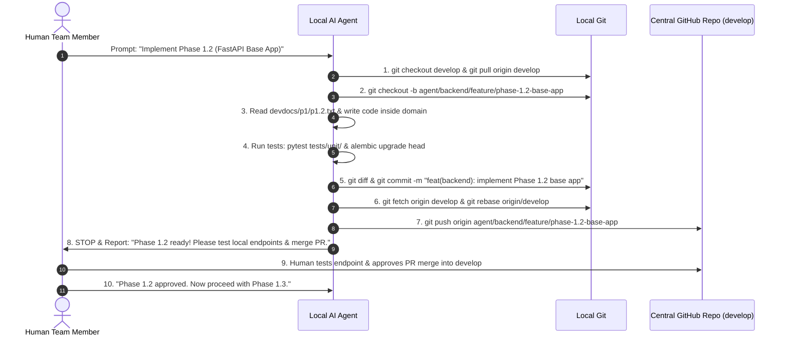

# Autonomous Multi-Developer Git Workflow & Collaboration Guide

> **Project KEEP — Multi-Member Autonomous AI Agent Operating Protocol**  
> *A Beginner-Friendly Guide to Conflict-Free Team Collaboration with Local AI Agents.*

---

## 1. Overview: How Multi-Member Autonomous Development Works

In this project, **4 human team members** work on their own separate machines (laptops/desktops) in parallel. Each member runs an **autonomous AI agent** (e.g., Antigravity AI) locally to write code, execute tests, and manage Git operations, all connecting to a shared central GitHub repository.

```mermaid
flowchart TD
    subgraph Member1_Machine ["Member 1 (AI Architect Laptop)"]
        A1[Member 1 Human] -->|Gives Task Prompt| B1[Agent 1 (AI Architect)]
        B1 -->|Edits /backend/app/services/rag| G1[Local Git Branch]
    end

    subgraph Member2_Machine ["Member 2 (Backend Lead Laptop)"]
        A2[Member 2 Human] -->|Gives Task Prompt| B2[Agent 2 (Backend Lead)]
        B2 -->|Edits /backend/app/api & models| G2[Local Git Branch]
    end

    subgraph Member3_Machine ["Member 3 (Frontend Lead Laptop)"]
        A3[Member 3 Human] -->|Gives Task Prompt| B3[Agent 3 (Frontend Lead)]
        B3 -->|Edits /frontend/src/| G3[Local Git Branch]
    end

    subgraph Member4_Machine ["Member 4 (DevOps Lead Laptop)"]
        A4[Member 4 Human] -->|Gives Task Prompt| B4[Agent 4 (DevOps Lead)]
        B4 -->|Edits /docker & infrastructure| G4[Local Git Branch]
    end

    G1 -->|Push PR| Central[Central GitHub Repo develop branch]
    G2 -->|Push PR| Central
    G3 -->|Push PR| Central
    G4 -->|Push PR| Central
```

---

## 2. Phase 0: Day 1 — How to Start Work (First Time Setup)

Each team member must follow these **3 simple steps** on their own machine before starting development:

### Step 0.1: Clone the Repository
Open your terminal (PowerShell / Command Prompt / Terminal) and run:
```bash
git clone https://github.com/your-org/kyoku.git
cd kyoku
```

### Step 0.2: Configure Git & Checkout `develop` Branch
Set your name and email (so GitHub knows who you are):
```bash
git config user.name "Your Name"
git config user.email "your.email@example.com"

# Checkout the shared development branch
git checkout develop
git pull origin develop
```

### Step 0.3: Load Your Local Agent Role Prompt
Open your AI Agent interface (e.g. Antigravity IDE) on your machine. Load your specific agent role prompt into your agent session:
- **Member 1 (AI Architect)**: Load prompt for AI / RAG services.
- **Member 2 (Backend Lead)**: Load [`agent_role.txt`](file:///d:/New%20folder%20%282%29/kyoku/agent_role.txt).
- **Member 3 (Frontend Lead)**: Load Frontend role prompt.
- **Member 4 (DevOps & QA Lead)**: Load DevOps role prompt.

---

## 3. The 4 Golden Rules of Zero Merge Conflicts

Why do merge conflicts happen? Merge conflicts happen when two people (or two agents) change the **same line of code in the same file** at the same time.

We completely prevent merge conflicts by using **4 Golden Rules**:

### Rule 1: Strict Domain Ownership ("Traffic Lanes")
Each agent is assigned exclusive ownership of specific directories. Agents **NEVER** edit files outside their domain:

| Team Member & Role | Agent Domain / Folder Boundary | Permitted Folders |
| :--- | :--- | :--- |
| **Member 1 (AI Lead)** | AI & RAG Engine | `/backend/app/services/rag`, `/backend/app/services/ai` |
| **Member 2 (Backend Lead)** | Backend API & Database | `/backend/app/api`, `/backend/app/models`, `/backend/app/db`, `/backend/app/core` |
| **Member 3 (Frontend Lead)** | Frontend Application | `/frontend/src/` |
| **Member 4 (DevOps Lead)** | Infrastructure & QA | `/docker`, `/infrastructure`, `.github/`, `/tests/` |

> 💡 **Analogy**: Think of it as a 4-lane highway. Member 1 drives in Lane 1, Member 2 in Lane 2, Member 3 in Lane 3, Member 4 in Lane 4. Nobody changes lanes without a formal handoff signal!

### Rule 2: Contract-First Development
Before writing code, team members agree on API definitions and Database Schemas:
- **API Contracts**: Documented in `docs/api/api-contract.md`
- **Database Schema**: Documented in `docs/database/database-schema.md`

If Member 3 (Frontend) needs a new API from Member 2 (Backend), Member 2 updates `docs/api/api-contract.md` first so both agents know the exact JSON structure.

### Rule 3: Branch Isolation Naming Standard
No agent ever commits directly to `main` or `develop`. Every feature gets its own branch using this strict naming pattern:
- Member 1: `agent/ai/feature/<feature-name>`
- Member 2: `agent/backend/feature/<feature-name>`
- Member 3: `agent/frontend/feature/<feature-name>`
- Member 4: `agent/devops/feature/<feature-name>`

### Rule 4: Strict Single Sub-Phase Gating & Human Testing
**Agents NEVER work endlessly through multiple sub-phases autonomously!**  
Each agent executes **strictly ONE sub-phase at a time** (e.g., Phase 1.2), runs tests locally, commits clean code, creates a Pull Request, and **PAUSES**.  
The human team member tests the functionality locally. Only after human sign-off does the agent proceed to the next sub-phase (e.g., Phase 1.3).

---

## 4. Step-by-Step Daily Execution Protocol for Member & Local Agent

Here is the exact step-by-step workflow followed for every sub-phase:



### Detailed Terminal Commands Executed by Agent:

#### Step 1: Sync Local `develop` Branch
```bash
git checkout develop
git pull origin develop
```

#### Step 2: Create Isolated Feature Branch
```bash
git checkout -b agent/backend/feature/phase-1.2-base-app
```

#### Step 3: Implement Sub-Phase Code & Local Verification
The agent writes code exclusively within its assigned domain (e.g., `/backend/app/api`).  
Then the agent runs automated tests:
```bash
# Backend Verification Commands
pytest tests/unit/
alembic upgrade head
```

#### Step 4: Inspect Diff & Commit Cleanly
```bash
# Check changed files
git status

# Inspect code diffs to ensure no leftover debug logs
git diff

# Stage and commit
git add .
git commit -m "feat(backend): Phase 1.2 - implement FastAPI base app and CORS middleware"
```

#### Step 5: Autonomous Rebase & Push
Before pushing, the agent syncs with latest updates merged by other team members:
```bash
# Fetch latest remote changes
git fetch origin develop

# Rebase local branch onto latest develop
git rebase origin/develop

# Push feature branch to central GitHub
git push -u origin agent/backend/feature/phase-1.2-base-app
```

#### Step 6: Update Handoff Log & Pause for Human Sign-off
The agent updates `docs/handoffs/agent-handoffs.md` with:
- Sub-phase completed (e.g., Phase 1.2)
- Added endpoints & updated files
- Status of local test verification

**The agent then STOPS execution and reports to the human user:**
> *"Phase 1.2 implementation complete! Automated tests passed. Please test the backend locally at `http://localhost:8000/docs`, review Pull Request `#12`, and provide approval before I begin Phase 1.3."*

---

## 5. Cross-Member Asynchronous Handoff Protocol

When Member 3 (Frontend Lead) needs a feature developed by Member 2 (Backend Lead):

1. **Contract Definition**: Member 2 defines the endpoint in `docs/api/api-contract.md` (e.g., `POST /api/v1/auth/login`).
2. **Handoff Log Entry**: Member 2 logs completion in `docs/handoffs/agent-handoffs.md`:
   ```markdown
   ## [Phase 1.4 Handoff] Backend Auth Endpoints Ready
   - **Sender**: Agent 2 (Backend Lead)
   - **Recipient**: Agent 3 (Frontend Lead)
   - **Status**: Complete & Verified
   - **Endpoint**: POST /api/v1/auth/login
   - **Payload Specs**: See docs/api/api-contract.md#auth-login
   ```
3. **Frontend Agent Pulls Handoff**: Member 3's agent reads `docs/handoffs/agent-handoffs.md`, pulls updated `develop`, and builds the login UI consuming the exact contract.

---

## 6. Beginner Troubleshooting & Emergency Recovery Guide

If something unexpected happens during Git operations, follow these simple steps:

### Scenario A: "Git Rebase Conflict Warning"
If `git rebase origin/develop` shows a conflict message:
1. Don't panic! Abort the rebase immediately to restore your code safely:
   ```bash
   git rebase --abort
   ```
2. Verify you didn't accidentally edit a file outside your domain boundary:
   ```bash
   git status
   ```
3. If an edit spilled over into another member's folder (e.g., `frontend/`), revert that specific file:
   ```bash
   git checkout origin/develop -- frontend/src/some-file.tsx
   ```
4. Retry the rebase cleanly:
   ```bash
   git rebase origin/develop
   ```

### Scenario B: "How do I check what branch I am on?"
```bash
git branch
```
*(The branch with an asterisk `*` is your active branch).*

### Scenario C: "How do I sync my laptop with the team's latest code?"
```bash
git checkout develop
git fetch origin
git pull origin develop
```

---

## 7. Summary Checklist for Team Members

- [x] **Setup**: Clone repo, set Git user config, checkout `develop`.
- [x] **Role**: Load your specific agent role prompt into your local agent.
- [x] **Domain**: Ensure your agent stays strictly within its folder boundaries.
- [x] **Gating**: Ensure your agent executes **ONE sub-phase at a time** and pauses for your local testing and sign-off.
- [x] **Handoffs**: Check `docs/handoffs/agent-handoffs.md` for updates from teammates.
