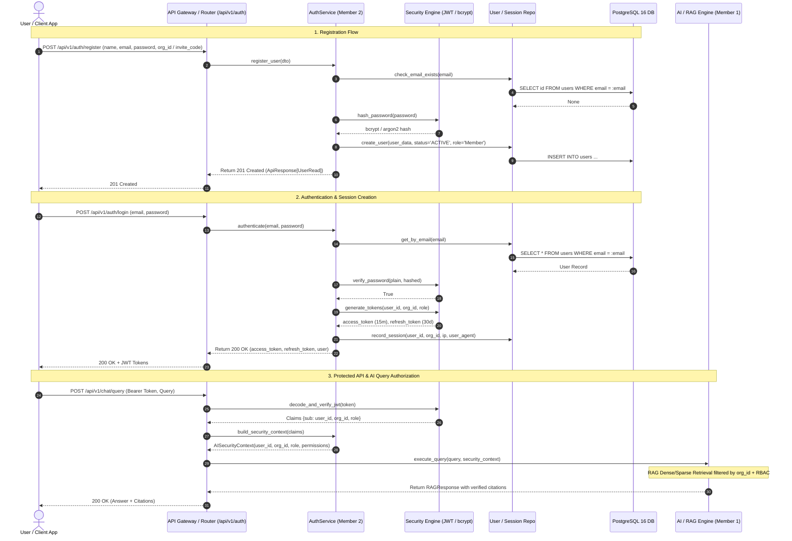
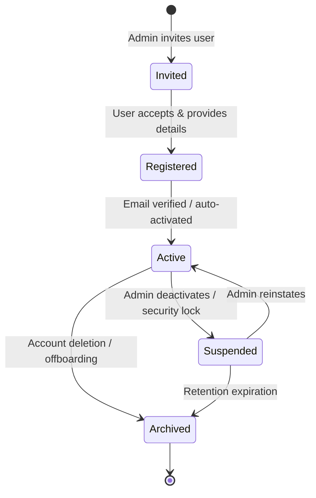
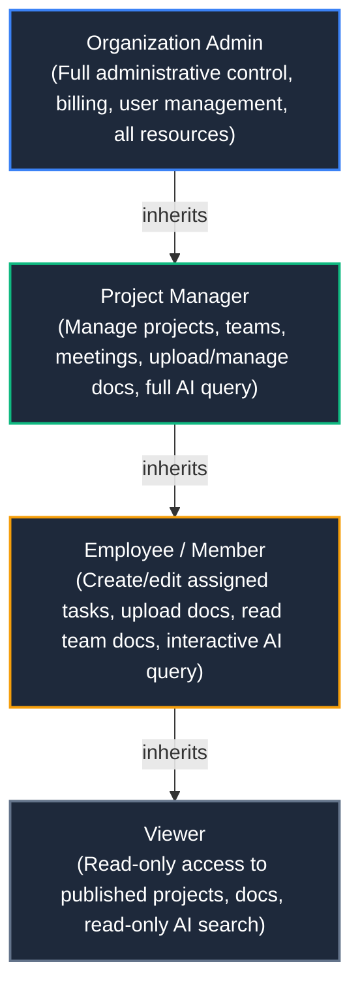

# KEEP — Authentication, Identity Management & AI Security Architecture (docs/Architecture/auth-identity-architecture.md)

> **Master Architecture Specification for KEEP Authentication, Identity & Multi-Tenant Authorization**  
> *Author: Member 1 (Project Lead & AI Architect)*  
> *Derived from: devdocs/p1/p1.4.txt (Chapters 1–23)*  
> *Target Implementers: Member 2 (Backend Lead), Member 3 (Frontend Lead), Member 4 (DevOps Lead)*

---

## 1. Executive Summary & Architectural Vision

Authentication in **KEEP (Knowledge Extraction & Enterprise Platform)** constitutes the primary security and trust boundary. Every request accessing organizational knowledge assets—unstructured documents, vector embeddings, relational knowledge graphs, task records, and conversational AI agents—must be cryptographically verified, tenant-scoped, and evaluated against strict Role-Based Access Control (RBAC) policies.

This document defines the architectural blueprint for:
1. **End-to-End Authentication Lifecycle**: Registration, email verification, login, session lifecycle, token refresh, password recovery, and secure logout.
2. **Multi-Tenant Identity Model**: Strict organizational tenancy boundaries (`organization_id`), account lifecycle states, and tenant isolation guarantees.
3. **Enterprise RBAC Engine**: Formal role taxonomy, hierarchical permission inheritance, and granular action-resource mappings.
4. **AI Service Security & Context Gating**: Zero-trust access control for Hybrid RAG dense/sparse vector retrieval, conversational state persistence, and Knowledge Graph traversals.
5. **Cryptographic Standards & Session Management**: Stateless JWT double-token protocol, session tracking, token revocation, and Argon2id/bcrypt password security.
6. **Audit Trail & Governance**: Tamper-evident logging of all authentication, authorization, and AI access events.

---

## 2. End-to-End Authentication & Authorization Lifecycle



---

## 3. Identity Model & Multi-Tenant Boundaries

### 3.1 Single-Tenant Membership per User (MVP Baseline)
In the MVP architecture, each registered user belongs to **exactly one** organization:
$$\text{User} \xrightarrow{N:1} \text{Organization}$$

All operational queries, database lookups, vector similarities, and graph edges are scoped strictly to the authenticated `organization_id`. Cross-tenant data leakage is structurally impossible at the persistence layer.

### 3.2 Account Lifecycle States
Every user entity transitions through defined lifecycle states that govern system accessibility:



| Account State | Authentication Permitted | API Access | AI Inference Permitted | Description |
| :--- | :---: | :---: | :---: | :--- |
| `INVITED` | ❌ No | ❌ No | ❌ No | User invited via email token; credentials not yet set |
| `REGISTERED` | ❌ No (pending verification) | ❌ No | ❌ No | Profile created; awaiting email confirmation (if enabled) |
| `ACTIVE` | ✅ Yes | ✅ Yes (RBAC bounded) | ✅ Yes (Quota bounded) | Fully operational user with full role permissions |
| `SUSPENDED` | ❌ No | ❌ No | ❌ No | Temporarily disabled by Admin or brute-force threshold |
| `ARCHIVED` | ❌ No | ❌ No | ❌ No | Soft-deleted user record; historical logs retained |

---

## 4. Role-Based Access Control (RBAC) Specification

### 4.1 Four-Role MVP Hierarchy
KEEP defines 4 core organizational roles in strict hierarchical order:

$$\text{Organization Admin} \succ \text{Project Manager} \succ \text{Employee (Member)} \succ \text{Viewer}$$



### 4.2 Comprehensive Permission Matrix

| Resource Domain | Permission Key | Description | Viewer | Employee | Project Manager | Org Admin |
| :--- | :--- | :--- | :---: | :---: | :---: | :---: |
| **Authentication** | `auth:me` | Read own profile & session | ✅ | ✅ | ✅ | ✅ |
| | `auth:change_password` | Update own account password | ✅ | ✅ | ✅ | ✅ |
| **Organization** | `org:read` | View organization metadata | ✅ | ✅ | ✅ | ✅ |
| | `org:manage` | Edit organization details & settings | ❌ | ❌ | ❌ | ✅ |
| **User Management** | `users:read` | List organizational members | ✅ | ✅ | ✅ | ✅ |
| | `users:invite` | Invite new users to organization | ❌ | ❌ | ❌ | ✅ |
| | `users:manage` | Change roles, suspend, or archive users | ❌ | ❌ | ❌ | ✅ |
| **Documents** | `doc:read` | View & download accessible documents | ✅ | ✅ | ✅ | ✅ |
| | `doc:create` | Upload new documents & trigger OCR/ingestion | ❌ | ✅ | ✅ | ✅ |
| | `doc:update` | Update document metadata/tags | ❌ | ✅ (own) | ✅ | ✅ |
| | `doc:delete` | Soft-delete document & remove embeddings | ❌ | ❌ | ✅ | ✅ |
| **Projects & Teams**| `project:read` | View projects and assignments | ✅ | ✅ | ✅ | ✅ |
| | `project:write` | Create and edit project milestones/tasks | ❌ | ✅ (assigned)| ✅ | ✅ |
| | `project:manage`| Create/archive projects, assign teams | ❌ | ❌ | ✅ | ✅ |
| | `team:manage` | Create teams, assign team leads | ❌ | ❌ | ✅ | ✅ |
| **Meetings** | `meeting:read` | View transcripts, agendas, and summaries | ✅ | ✅ | ✅ | ✅ |
| | `meeting:create` | Schedule meetings, upload audio/notes | ❌ | ✅ | ✅ | ✅ |
| | `meeting:delete` | Delete meeting records | ❌ | ❌ | ✅ | ✅ |
| **AI & Search** | `search:query` | Execute hybrid search queries | ✅ | ✅ | ✅ | ✅ |
| | `chat:query` | Interactive chat with RAG synthesis | ❌ | ✅ | ✅ | ✅ |
| | `chat:stream` | Real-time SSE streaming RAG responses | ❌ | ✅ | ✅ | ✅ |
| | `chat:history` | View personal chat history sessions | ❌ | ✅ | ✅ | ✅ |
| | `chat:manage_all`| Inspect tenant-wide AI audit logs | ❌ | ❌ | ❌ | ✅ |
| **Knowledge Graph**| `kg:read` | Query entity relationships & graph paths | ✅ | ✅ | ✅ | ✅ |
| | `kg:write` | Manually curate or edit graph entities | ❌ | ❌ | ✅ | ✅ |
| **Analytics & Audit**| `analytics:read`| View organization usage metrics & costs | ❌ | ❌ | ❌ | ✅ |
| | `audit:read` | Inspect enterprise security activity logs | ❌ | ❌ | ❌ | ✅ |

---

## 5. AI Service Security & Context Gating Architecture

### 5.1 The Zero-Trust AI Tenancy Boundary
In an enterprise RAG platform, the AI engine is the most sensitive data processor. An unauthenticated or improperly scoped query could synthesize confidential information across department or organizational lines.

```
                          [User HTTP Request]
                                   │
                                   ▼
                       [JWT Validation & Claims]
                      (sub: user_id, org_id: org_id, role)
                                   │
                                   ▼
                      [Security Context Builder]
                     AISecurityContext / RAGSecurityContext
                                   │
              ┌────────────────────┴────────────────────┐
              ▼                                         ▼
   [Hybrid Vector Retrieval]                 [Knowledge Graph Retrieval]
   WHERE organization_id = :org_id          WHERE organization_id = :org_id
     AND document_id IN (:allowed_docs)       AND visibility <= :user_role
              │                                         │
              └────────────────────┬────────────────────┘
                                   │
                                   ▼
                     [Candidate Reranking & Filter]
                                   │
                                   ▼
                      [LLM Context Construction]
                       (Zero-Trust Prompt Frame)
                                   │
                                   ▼
                      [LLM Provider (OpenAI/Local)]
                                   │
                                   ▼
                       [Citation Verification]
                    (Ensure all citations ∈ allowed_docs)
                                   │
                                   ▼
                     [Response + AI Audit Log Record]
```

### 5.2 Gated Hybrid Vector & Chunk Retrieval
Every search or RAG candidate query must enforce strict two-tier gating:
1. **Tenant Hard Barrier**: `WHERE organization_id = :context.organization_id` is non-negotiable and executed at the database/HNSW index level.
2. **Resource Permission Filtering**: If the querying user has restricted access (e.g., project-specific or team-specific access), the `VectorFilter` and `BaseRetriever` candidate list is filtered against the user's `allowed_document_ids` before context window assembly.

### 5.3 Knowledge Graph Isolation
Entity and relationship traversals (`BaseKnowledgeGraphStore`) must only traverse edges where `organization_id = :context.organization_id`. Graph paths intersecting unauthorized documents or private nodes are pruned before recursive CTE execution.

### 5.4 Conversational State Ownership
Chat sessions (`chat_sessions`) and messages (`chat_messages`) are strictly owned by `(organization_id, user_id)`:
- Users cannot access, read, or resume conversations created by other users unless explicitly assigned administrative audit privileges (`chat:manage_all`).
- All tool execution dispatches initiated by the AI agent inherit the invoking user's `AISecurityContext`.

### 5.5 Prompt Injection & Privilege Escalation Defenses
1. **Immutable System Guardrails**: The user identity and tenant boundary are established in system-level parameters, never parsed from unstructured user prompt text.
2. **Tool Access Controller**: AI tools/functions (e.g., database lookup, task creation, document export) are passed through `BaseAIAccessController.filter_tools_for_user(tools, security_context)`. If a user is a `Viewer`, destructive tools (e.g., `create_task`, `delete_doc`) are stripped from the LLM tool definition list.

---

## 6. Cryptographic Standards & Session Architecture

### 6.1 Password Security Standard
- **Algorithm**: Salted bcrypt (work factor: 12) or Argon2id (`time_cost=3`, `memory_cost=65536`, `parallelism=4`).
- **Policy Requirements**:
  - Minimum length: 8 characters (Recommended 12+).
  - At least one uppercase letter (`[A-Z]`).
  - At least one lowercase letter (`[a-z]`).
  - At least one numeric digit (`[0-9]`).
  - At least one special character (`[!@#$%^&*()_+\-=\[\]{}|;:,.<>?]`).
  - Prohibited common passwords against a top-10,000 dictionary.

### 6.2 Stateless JWT Double-Token Strategy
KEEP implements a dual-token architecture balancing high-throughput stateless API validation with secure revocation:

| Token Type | Lifetime | Purpose | Storage Recommendation | Claims Schema |
| :--- | :--- | :--- | :--- | :--- |
| **Access Token** | 15–30 minutes | Authenticates API requests | Memory / Session State | `sub`, `org_id`, `email`, `role`, `type="access"`, `iat`, `exp` |
| **Refresh Token** | 14–30 days | Issues fresh access tokens | HttpOnly Secure Cookie / Secure Storage | `sub`, `org_id`, `type="refresh"`, `jti`, `iat`, `exp` |

### 6.3 Refresh Token Rotation & Session Revocation
- **One-Time Use**: When a refresh token is used to issue a new access token, the old refresh token is invalidated, and a new refresh token is issued (Token Rotation).
- **Session Revocation**: Upon explicit logout (`POST /api/v1/auth/logout`) or password reset, the user's active session is terminated, and the refresh token is marked revoked in persistence/cache.

---

## 7. Audit Logging & Compliance Framework

Authentication and authorization events represent critical compliance data under SOC 2, HIPAA, and GDPR. All identity events are persisted to `activity_logs` with the following mandatory schema:

```json
{
  "id": "e4b6b23a-...",
  "organization_id": "8bc92d11-...",
  "user_id": "3fa85f64-...",
  "action": "AUTH_LOGIN_SUCCESS",
  "resource_type": "user",
  "resource_id": "3fa85f64-...",
  "ip_address": "192.168.1.100",
  "user_agent": "Mozilla/5.0 ...",
  "status": "SUCCESS",
  "details": {
    "login_method": "password",
    "session_id": "sess_91230..."
  },
  "created_at": "2026-10-09T00:30:00Z"
}
```

### Audited Event Types
1. `AUTH_REGISTER_SUCCESS` / `AUTH_REGISTER_FAILURE`
2. `AUTH_LOGIN_SUCCESS` / `AUTH_LOGIN_FAILURE` (tracks brute-force attempts)
3. `AUTH_LOGOUT`
4. `AUTH_TOKEN_REFRESH`
5. `AUTH_PASSWORD_RESET_REQUESTED` / `AUTH_PASSWORD_RESET_COMPLETED`
6. `AUTH_PASSWORD_CHANGED`
7. `AUTH_USER_SUSPENDED` / `AUTH_USER_ACTIVATED`
8. `AUTH_ROLE_MODIFIED`

---

## 8. Definition of Done (DoD) Checklist for Phase 1.4

- [x] **Architecture Specification**: Authored `docs/Architecture/auth-identity-architecture.md` defining identity, RBAC, session lifecycle, and AI compatibility.
- [x] **Decision Records**: Authored ADR-011, ADR-012, and ADR-013 in `docs/decisions/decisions.md`.
- [x] **API Contracts**: Formally specified all 8 Auth REST endpoints in `docs/api/api-contract.md`.
- [x] **AI Domain Security Contracts**: Defined `AISecurityContext`, `RAGSecurityContext`, `BaseAIAccessController`, and `BaseRAGAccessController` in `/backend/app/services/ai` and `/backend/app/services/rag`.
- [x] **Empirical Verification**: Authored and passed test suite `tests/unit/test_auth_ai_security_contracts.py` with 100% pass rate.
- [x] **Team Handoff**: Documented deliverables and next actions for Member 2, Member 3, and Member 4 in `docs/handoffs/agent-handoffs.md` and `PROJECT_STATE.md`.
