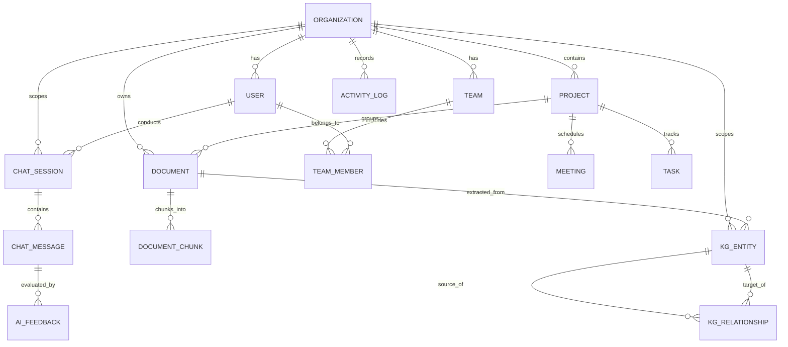

# Database Schema Specification (docs/database/database-schema.md)

> **Official Engineering Database & Persistence Layer Specification for KEEP**  
> *Approved by: Member 1 (Project Lead & AI Architect)*  
> *Target Implementer: Member 2 (Backend Lead) | Consumer: Member 3 (Frontend Lead) | Ops: Member 4 (DevOps Lead)*  
> *Derived from: devdocs/p1/p1.3.txt (Chapters 1–22)*

---

## 1. Relational Database Overview & Technology Stack

KEEP uses **PostgreSQL 16** enhanced with the **pgvector** extension as its unified multi-tenant relational persistence and vector similarity store. All application models are defined using **SQLAlchemy 2.0 ORM** (fully typed, async-first via `asyncpg`), and schema migrations are tracked and applied via **Alembic**.

### 1.1 Technology Matrix
| Layer / Component | Technology | Version | Purpose |
| :--- | :--- | :--- | :--- |
| **Relational Database** | PostgreSQL | 16 Alpine | Primary multi-tenant relational data store |
| **Vector Search Extension** | pgvector | 0.7+ | 1536-dim / 384-dim dense embedding index (HNSW / IVFFlat) |
| **ORM & Query Builder** | SQLAlchemy | 2.0+ (Async) | Typed models, session lifecycle, Unit of Work |
| **Database Driver** | asyncpg / psycopg2 | latest | High-performance asynchronous PostgreSQL driver |
| **Schema Migrations** | Alembic | latest | Version-controlled, reproducible schema revisions |
| **Data Validation** | Pydantic v2 | 2.8+ | Ingestion DTO validation & serialization |

---

## 2. Global Model Mixins & Standards

All database tables in KEEP conform to strict enterprise standards:
1. **UUID Primary Keys**: Every table uses a RFC 4122 compliant UUID primary key generated via `uuid.uuid4()` / `gen_random_uuid()`.
2. **Audit Timestamps (`TimestampMixin`)**: Every record tracks `created_at` (UTC timestamp) and `updated_at` (UTC timestamp automatically updated on change).
3. **Soft Deletion (`SoftDeleteMixin`)**: Critical entities implement `is_deleted` (boolean, default `FALSE`) and `deleted_at` (timestamp, default `NULL`).
4. **Tenant Segregation (`TenantMixin`)**: All tenant-scoped tables enforce a foreign key `organization_id` referencing `organizations(id)` with `ON DELETE CASCADE`.

---

## 3. Entity Schemas & Tables

### 3.1 `organizations` Table
Root container for enterprise multi-tenancy.

| Column | Type | Constraints | Description |
| :--- | :--- | :--- | :--- |
| `id` | `UUID` | Primary Key, Default `gen_random_uuid()` | Unique organization identifier |
| `name` | `VARCHAR(255)` | NOT NULL | Enterprise display name |
| `domain` | `VARCHAR(255)` | NOT NULL, Unique | Organization primary domain (e.g. `enterprise.com`) |
| `subscription_tier` | `VARCHAR(50)` | NOT NULL, Default `'Enterprise'` | Billing / SLA tier (`Free`, `Pro`, `Enterprise`) |
| `max_users` | `INT` | NOT NULL, Default `1000` | User seat quota |
| `max_storage_bytes` | `BIGINT` | NOT NULL, Default `107374182400` | Storage quota (default 100 GB) |
| `ai_monthly_token_quota` | `BIGINT` | NOT NULL, Default `10000000` | Monthly LLM token quota |
| `is_active` | `BOOLEAN` | NOT NULL, Default `TRUE` | Tenant operational status |
| `is_deleted` | `BOOLEAN` | NOT NULL, Default `FALSE` | Soft delete flag |
| `deleted_at` | `TIMESTAMP WITH TIME ZONE` | NULL | Soft delete timestamp |
| `created_at` | `TIMESTAMP WITH TIME ZONE` | NOT NULL, Default `NOW()` | Registration timestamp |
| `updated_at` | `TIMESTAMP WITH TIME ZONE` | NOT NULL, Default `NOW()` | Last modification timestamp |

---

### 3.2 `users` Table
Stores enterprise user credentials, profile information, and role assignments.

| Column | Type | Constraints | Description |
| :--- | :--- | :--- | :--- |
| `id` | `UUID` | Primary Key, Default `gen_random_uuid()` | Unique user identifier |
| `organization_id` | `UUID` | NOT NULL, FK -> `organizations.id` | Tenant boundary foreign key |
| `email` | `VARCHAR(255)` | NOT NULL | User login email |
| `hashed_password` | `VARCHAR(255)` | NOT NULL | Bcrypt / Argon2 hashed password |
| `full_name` | `VARCHAR(255)` | NOT NULL | User full legal/display name |
| `role` | `VARCHAR(50)` | NOT NULL, Default `'Member'` | RBAC role (`SuperAdmin`, `OrgAdmin`, `Manager`, `Member`, `Guest`) |
| `avatar_url` | `VARCHAR(512)` | NULL | Optional profile avatar image URL |
| `is_active` | `BOOLEAN` | NOT NULL, Default `TRUE` | User account active status |
| `is_verified` | `BOOLEAN` | NOT NULL, Default `FALSE` | Email verification flag |
| `is_deleted` | `BOOLEAN` | NOT NULL, Default `FALSE` | Soft delete flag |
| `deleted_at` | `TIMESTAMP WITH TIME ZONE` | NULL | Soft delete timestamp |
| `created_at` | `TIMESTAMP WITH TIME ZONE` | NOT NULL, Default `NOW()` | Registration timestamp |
| `updated_at` | `TIMESTAMP WITH TIME ZONE` | NOT NULL, Default `NOW()` | Last modification timestamp |

**Table Constraints**:
- `CONSTRAINT uq_users_org_email UNIQUE (organization_id, email)`

---

### 3.3 `teams` & `team_members` Tables
Models departmental divisions and collaborative workspaces.

#### `teams` Table:
| Column | Type | Constraints | Description |
| :--- | :--- | :--- | :--- |
| `id` | `UUID` | Primary Key, Default `gen_random_uuid()` | Unique team identifier |
| `organization_id` | `UUID` | NOT NULL, FK -> `organizations.id` | Tenant boundary foreign key |
| `name` | `VARCHAR(255)` | NOT NULL | Department / Team name (e.g. `Engineering`) |
| `description` | `TEXT` | NULL | Team charter or description |
| `lead_user_id` | `UUID` | NULL, FK -> `users.id` | Assigned team lead |
| `is_deleted` | `BOOLEAN` | NOT NULL, Default `FALSE` | Soft delete flag |
| `deleted_at` | `TIMESTAMP WITH TIME ZONE` | NULL | Soft delete timestamp |
| `created_at` | `TIMESTAMP WITH TIME ZONE` | NOT NULL, Default `NOW()` | Creation timestamp |
| `updated_at` | `TIMESTAMP WITH TIME ZONE` | NOT NULL, Default `NOW()` | Last modification timestamp |

**Table Constraints**:
- `CONSTRAINT uq_teams_org_name UNIQUE (organization_id, name)`

#### `team_members` Table:
| Column | Type | Constraints | Description |
| :--- | :--- | :--- | :--- |
| `team_id` | `UUID` | NOT NULL, FK -> `teams.id` ON DELETE CASCADE | Parent team |
| `user_id` | `UUID` | NOT NULL, FK -> `users.id` ON DELETE CASCADE | Member user |
| `role_in_team` | `VARCHAR(50)` | NOT NULL, Default `'Member'` | Team-level role (`Lead`, `Member`, `Observer`) |
| `created_at` | `TIMESTAMP WITH TIME ZONE` | NOT NULL, Default `NOW()` | Join timestamp |

**Table Constraints**:
- `PRIMARY KEY (team_id, user_id)`

---

### 3.4 `projects` Table
Enterprise initiatives, workspaces, and knowledge groupings.

| Column | Type | Constraints | Description |
| :--- | :--- | :--- | :--- |
| `id` | `UUID` | Primary Key, Default `gen_random_uuid()` | Unique project identifier |
| `organization_id` | `UUID` | NOT NULL, FK -> `organizations.id` | Tenant boundary foreign key |
| `team_id` | `UUID` | NULL, FK -> `teams.id` | Associated team |
| `owner_id` | `UUID` | NOT NULL, FK -> `users.id` | Project creator / owner |
| `name` | `VARCHAR(255)` | NOT NULL | Project name |
| `description` | `TEXT` | NULL | Project scope and details |
| `status` | `VARCHAR(50)` | NOT NULL, Default `'ACTIVE'` | Status (`ACTIVE`, `ARCHIVED`, `COMPLETED`) |
| `priority` | `VARCHAR(50)` | NOT NULL, Default `'MEDIUM'` | Priority (`LOW`, `MEDIUM`, `HIGH`, `CRITICAL`) |
| `is_deleted` | `BOOLEAN` | NOT NULL, Default `FALSE` | Soft delete flag |
| `deleted_at` | `TIMESTAMP WITH TIME ZONE` | NULL | Soft delete timestamp |
| `created_at` | `TIMESTAMP WITH TIME ZONE` | NOT NULL, Default `NOW()` | Creation timestamp |
| `updated_at` | `TIMESTAMP WITH TIME ZONE` | NOT NULL, Default `NOW()` | Last modification timestamp |

---

### 3.5 `documents` Table
Raw uploaded files and document metadata.

| Column | Type | Constraints | Description |
| :--- | :--- | :--- | :--- |
| `id` | `UUID` | Primary Key, Default `gen_random_uuid()` | Unique document identifier |
| `organization_id` | `UUID` | NOT NULL, FK -> `organizations.id` | Tenant boundary foreign key |
| `uploader_id` | `UUID` | NOT NULL, FK -> `users.id` | User who uploaded the file |
| `project_id` | `UUID` | NULL, FK -> `projects.id` | Associated project container |
| `filename` | `VARCHAR(255)` | NOT NULL | Original filename |
| `file_path` | `TEXT` | NOT NULL | Storage URI (local disk path or S3 key) |
| `file_type` | `VARCHAR(50)` | NOT NULL | MIME type / file format (`pdf`, `docx`, `txt`, `png`) |
| `file_size` | `BIGINT` | NOT NULL | File size in bytes |
| `status` | `VARCHAR(50)` | NOT NULL, Default `'PENDING'` | Ingestion status (`PENDING`, `PROCESSING`, `PROCESSED`, `FAILED`) |
| `chunk_count` | `INT` | NOT NULL, Default `0` | Number of generated chunks |
| `error_message` | `TEXT` | NULL | Parsing error details if failed |
| `metadata_json` | `JSONB` | NOT NULL, Default `'{}'::jsonb` | Extracted author, page count, OCR quality |
| `is_deleted` | `BOOLEAN` | NOT NULL, Default `FALSE` | Soft delete flag |
| `deleted_at` | `TIMESTAMP WITH TIME ZONE` | NULL | Soft delete timestamp |
| `created_at` | `TIMESTAMP WITH TIME ZONE` | NOT NULL, Default `NOW()` | Upload timestamp |
| `updated_at` | `TIMESTAMP WITH TIME ZONE` | NOT NULL, Default `NOW()` | Last modification timestamp |

---

### 3.6 `document_chunks` Table (Vector Persistence Layer)
Stores text chunks, vector embeddings, and chunk metadata for Hybrid RAG.

| Column | Type | Constraints | Description |
| :--- | :--- | :--- | :--- |
| `id` | `UUID` | Primary Key, Default `gen_random_uuid()` | Unique chunk identifier |
| `organization_id` | `UUID` | NOT NULL, FK -> `organizations.id` ON DELETE CASCADE | Multi-tenant boundary |
| `document_id` | `UUID` | NOT NULL, FK -> `documents.id` ON DELETE CASCADE | Parent document reference |
| `chunk_index` | `INT` | NOT NULL | Sequential chunk index within document |
| `content` | `TEXT` | NOT NULL | Raw chunk text content |
| `token_count` | `INT` | NOT NULL, Default `0` | Estimated token count |
| `page_number` | `INT` | NULL | Provenanced page number in source document |
| `section_title` | `VARCHAR(255)` | NULL | Heading / Section title |
| `embedding` | `vector(1536)` | NULL | Vector embedding (OpenAI / HuggingFace) |
| `metadata_json` | `JSONB` | NOT NULL, Default `'{}'::jsonb` | Additional chunk metadata (e.g. bounding boxes) |
| `tsv_content` | `tsvector` | GENERATED STORED | Full-text search vector for lexical BM25 matching |
| `created_at` | `TIMESTAMP WITH TIME ZONE` | NOT NULL, Default `NOW()` | Creation timestamp |
| `updated_at` | `TIMESTAMP WITH TIME ZONE` | NOT NULL, Default `NOW()` | Last modification timestamp |

**Table Constraints**:
- `CONSTRAINT uq_chunks_doc_idx UNIQUE (document_id, chunk_index)`

---

### 3.7 `kg_entities` & `kg_relationships` Tables (Knowledge Graph MVP)
Models interconnected enterprise semantic entities and relations in PostgreSQL.

#### `kg_entities` Table:
| Column | Type | Constraints | Description |
| :--- | :--- | :--- | :--- |
| `id` | `UUID` | Primary Key, Default `gen_random_uuid()` | Unique entity identifier |
| `organization_id` | `UUID` | NOT NULL, FK -> `organizations.id` ON DELETE CASCADE | Tenant boundary |
| `name` | `VARCHAR(255)` | NOT NULL | Normalized entity name |
| `entity_type` | `VARCHAR(100)` | NOT NULL | Entity type (`Person`, `Project`, `Technology`, `Department`, `Document`) |
| `description` | `TEXT` | NULL | Semantic description |
| `source_document_id`| `UUID` | NULL, FK -> `documents.id` ON DELETE SET NULL | Origin document if extracted by AI |
| `properties` | `JSONB` | NOT NULL, Default `'{}'::jsonb` | Arbitrary key-value properties |
| `created_at` | `TIMESTAMP WITH TIME ZONE` | NOT NULL, Default `NOW()` | Creation timestamp |
| `updated_at` | `TIMESTAMP WITH TIME ZONE` | NOT NULL, Default `NOW()` | Last modification timestamp |

**Table Constraints**:
- `CONSTRAINT uq_kg_entity_org_name_type UNIQUE (organization_id, name, entity_type)`

#### `kg_relationships` Table:
| Column | Type | Constraints | Description |
| :--- | :--- | :--- | :--- |
| `id` | `UUID` | Primary Key, Default `gen_random_uuid()` | Unique relationship edge identifier |
| `organization_id` | `UUID` | NOT NULL, FK -> `organizations.id` ON DELETE CASCADE | Tenant boundary |
| `source_entity_id` | `UUID` | NOT NULL, FK -> `kg_entities.id` ON DELETE CASCADE | Origin entity |
| `target_entity_id` | `UUID` | NOT NULL, FK -> `kg_entities.id` ON DELETE CASCADE | Target entity |
| `relation_type` | `VARCHAR(100)` | NOT NULL | Directed relation (`AUTHOR_OF`, `ASSIGNED_TO`, `DEPENDS_ON`, `BELONGS_TO`) |
| `weight` | `FLOAT` | NOT NULL, Default `1.0` | Edge strength / frequency |
| `confidence_score`| `FLOAT` | NOT NULL, Default `1.0` | AI extraction confidence (0.0 to 1.0) |
| `source_document_id`| `UUID` | NULL, FK -> `documents.id` ON DELETE SET NULL | Origin document |
| `properties` | `JSONB` | NOT NULL, Default `'{}'::jsonb` | Edge metadata |
| `created_at` | `TIMESTAMP WITH TIME ZONE` | NOT NULL, Default `NOW()` | Creation timestamp |
| `updated_at` | `TIMESTAMP WITH TIME ZONE` | NOT NULL, Default `NOW()` | Last modification timestamp |

---

### 3.8 `meetings` & `tasks` Tables

#### `meetings` Table:
| Column | Type | Constraints | Description |
| :--- | :--- | :--- | :--- |
| `id` | `UUID` | Primary Key, Default `gen_random_uuid()` | Unique meeting identifier |
| `organization_id` | `UUID` | NOT NULL, FK -> `organizations.id` | Tenant boundary |
| `project_id` | `UUID` | NULL, FK -> `projects.id` | Related project |
| `organizer_id` | `UUID` | NOT NULL, FK -> `users.id` | Meeting organizer |
| `title` | `VARCHAR(255)` | NOT NULL | Meeting title |
| `scheduled_start` | `TIMESTAMP WITH TIME ZONE` | NOT NULL | Start time |
| `scheduled_end` | `TIMESTAMP WITH TIME ZONE` | NOT NULL | End time |
| `recording_url` | `VARCHAR(512)` | NULL | Optional recording link |
| `transcript_text`| `TEXT` | NULL | Raw or processed transcript text |
| `summary_text` | `TEXT` | NULL | AI-generated summary |
| `is_deleted` | `BOOLEAN` | NOT NULL, Default `FALSE` | Soft delete flag |
| `deleted_at` | `TIMESTAMP WITH TIME ZONE` | NULL | Soft delete timestamp |
| `created_at` | `TIMESTAMP WITH TIME ZONE` | NOT NULL, Default `NOW()` | Creation timestamp |
| `updated_at` | `TIMESTAMP WITH TIME ZONE` | NOT NULL, Default `NOW()` | Last modification timestamp |

#### `tasks` Table:
| Column | Type | Constraints | Description |
| :--- | :--- | :--- | :--- |
| `id` | `UUID` | Primary Key, Default `gen_random_uuid()` | Unique task identifier |
| `organization_id` | `UUID` | NOT NULL, FK -> `organizations.id` | Tenant boundary |
| `project_id` | `UUID` | NULL, FK -> `projects.id` | Related project |
| `creator_id` | `UUID` | NOT NULL, FK -> `users.id` | Task creator |
| `assignee_id` | `UUID` | NULL, FK -> `users.id` | Assigned user |
| `title` | `VARCHAR(255)` | NOT NULL | Task title |
| `description` | `TEXT` | NULL | Task details |
| `priority` | `VARCHAR(50)` | NOT NULL, Default `'MEDIUM'` | Priority (`LOW`, `MEDIUM`, `HIGH`, `CRITICAL`) |
| `status` | `VARCHAR(50)` | NOT NULL, Default `'TODO'` | Status (`TODO`, `IN_PROGRESS`, `DONE`, `CANCELLED`) |
| `due_date` | `TIMESTAMP WITH TIME ZONE` | NULL | Due date |
| `is_deleted` | `BOOLEAN` | NOT NULL, Default `FALSE` | Soft delete flag |
| `deleted_at` | `TIMESTAMP WITH TIME ZONE` | NULL | Soft delete timestamp |
| `created_at` | `TIMESTAMP WITH TIME ZONE` | NOT NULL, Default `NOW()` | Creation timestamp |
| `updated_at` | `TIMESTAMP WITH TIME ZONE` | NOT NULL, Default `NOW()` | Last modification timestamp |

---

### 3.9 `chat_sessions`, `chat_messages` & `ai_feedback` Tables

#### `chat_sessions` Table:
| Column | Type | Constraints | Description |
| :--- | :--- | :--- | :--- |
| `id` | `UUID` | Primary Key, Default `gen_random_uuid()` | Unique conversation session ID |
| `organization_id` | `UUID` | NOT NULL, FK -> `organizations.id` | Tenant boundary |
| `user_id` | `UUID` | NOT NULL, FK -> `users.id` | User owner |
| `project_id` | `UUID` | NULL, FK -> `projects.id` | Optional project context filter |
| `title` | `VARCHAR(255)` | NOT NULL, Default `'New Conversation'` | Session topic |
| `is_archived` | `BOOLEAN` | NOT NULL, Default `FALSE` | Archived state |
| `is_deleted` | `BOOLEAN` | NOT NULL, Default `FALSE` | Soft delete flag |
| `deleted_at` | `TIMESTAMP WITH TIME ZONE` | NULL | Soft delete timestamp |
| `created_at` | `TIMESTAMP WITH TIME ZONE` | NOT NULL, Default `NOW()` | Creation timestamp |
| `updated_at` | `TIMESTAMP WITH TIME ZONE` | NOT NULL, Default `NOW()` | Last modification timestamp |

#### `chat_messages` Table:
| Column | Type | Constraints | Description |
| :--- | :--- | :--- | :--- |
| `id` | `UUID` | Primary Key, Default `gen_random_uuid()` | Unique message ID |
| `session_id` | `UUID` | NOT NULL, FK -> `chat_sessions.id` ON DELETE CASCADE | Parent conversation session |
| `role` | `VARCHAR(50)` | NOT NULL | Message role (`user`, `assistant`, `system`, `tool`) |
| `content` | `TEXT` | NOT NULL | Message text |
| `model_name` | `VARCHAR(100)` | NULL | AI model used (e.g. `gpt-4o`) |
| `tokens_prompt` | `INT` | NOT NULL, Default `0` | Prompt token count |
| `tokens_completion`| `INT` | NOT NULL, Default `0` | Completion token count |
| `latency_ms` | `FLOAT` | NOT NULL, Default `0.0` | Response generation latency |
| `citations_json` | `JSONB` | NOT NULL, Default `'[]'::jsonb` | Provenanced citations array |
| `tool_calls_json` | `JSONB` | NOT NULL, Default `'[]'::jsonb` | Tool invocations & arguments |
| `created_at` | `TIMESTAMP WITH TIME ZONE` | NOT NULL, Default `NOW()` | Timestamp |

#### `ai_feedback` Table:
| Column | Type | Constraints | Description |
| :--- | :--- | :--- | :--- |
| `id` | `UUID` | Primary Key, Default `gen_random_uuid()` | Feedback ID |
| `organization_id` | `UUID` | NOT NULL, FK -> `organizations.id` | Tenant boundary |
| `user_id` | `UUID` | NOT NULL, FK -> `users.id` | Feedback author |
| `message_id` | `UUID` | NOT NULL, FK -> `chat_messages.id` ON DELETE CASCADE | Evaluated AI message |
| `rating` | `INT` | NOT NULL | Rating (`1` for positive, `-1` for negative) |
| `comment` | `TEXT` | NULL | Optional text explanation |
| `created_at` | `TIMESTAMP WITH TIME ZONE` | NOT NULL, Default `NOW()` | Timestamp |

---

### 3.10 `activity_logs` Table (Audit Trail)
Immutable security and audit event logging.

| Column | Type | Constraints | Description |
| :--- | :--- | :--- | :--- |
| `id` | `UUID` | Primary Key, Default `gen_random_uuid()` | Unique audit event identifier |
| `organization_id` | `UUID` | NOT NULL, FK -> `organizations.id` | Tenant boundary |
| `user_id` | `UUID` | NULL, FK -> `users.id` | Actor user ID (NULL for system events) |
| `action` | `VARCHAR(100)` | NOT NULL | Action name (e.g. `USER_LOGIN`, `DOCUMENT_UPLOAD`, `AI_QUERY`) |
| `resource_type` | `VARCHAR(100)` | NOT NULL | Target entity type (`document`, `user`, `chat`) |
| `resource_id` | `VARCHAR(255)` | NULL | Target entity UUID string |
| `ip_address` | `VARCHAR(45)` | NULL | Client IP address |
| `user_agent` | `VARCHAR(512)` | NULL | Client user agent string |
| `metadata_json` | `JSONB` | NOT NULL, Default `'{}'::jsonb` | Detailed event payload |
| `created_at` | `TIMESTAMP WITH TIME ZONE` | NOT NULL, Default `NOW()` | Event timestamp |

---

## 4. Entity Relationship Diagram (ERD)



---

## 5. Indexing Matrix

| Table | Index Name | Index Method | Target Columns | Purpose |
| :--- | :--- | :--- | :--- | :--- |
| `users` | `idx_users_org_email` | B-tree (Unique) | `organization_id, email` | Multi-tenant auth lookup |
| `documents` | `idx_docs_org_status` | B-tree | `organization_id, status, created_at` | Ingestion status filtering |
| `document_chunks` | `idx_chunks_embedding_hnsw` | HNSW | `embedding (vector_cosine_ops)` | High-speed vector similarity |
| `document_chunks` | `idx_chunks_tsv` | GIN | `tsv_content` | BM25 lexical full-text search |
| `document_chunks` | `idx_chunks_org_doc` | B-tree | `organization_id, document_id` | Tenant chunk retrieval |
| `kg_entities` | `idx_kg_entities_org_type` | B-tree | `organization_id, entity_type` | Semantic entity lookups |
| `kg_relationships` | `idx_kg_rel_src` | B-tree | `organization_id, source_entity_id` | Forward graph traversals |
| `kg_relationships` | `idx_kg_rel_tgt` | B-tree | `organization_id, target_entity_id` | Reverse graph traversals |
| `chat_messages` | `idx_chat_msg_session` | B-tree | `session_id, created_at ASC` | Chronological chat history |
| `activity_logs` | `idx_activity_org_date` | B-tree | `organization_id, created_at DESC` | Security audit queries |

---

## 6. Migration Strategy & Versioning

1. All database migrations are managed using **Alembic** under `backend/migrations/versions/`.
2. Migration filenames follow the convention: `<revision_id>_<phase>_<slug>.py` (e.g. `001_p1_3_core_persistence_schema.py`).
3. Migrations must implement both `upgrade()` and `downgrade()` methods cleanly.
4. Auto-generation commands:
   ```bash
   alembic revision --autogenerate -m "feat(phase-1.3): implement core persistence layer and vector models"
   ```
5. Applying migrations:
   ```bash
   alembic upgrade head
   ```

---

## 7. Domain Ownership

- **Architecture & AI Validation Lead**: Member 1 (Project Lead & AI Architect)
- **Primary Code Owner & Implementation**: Member 2 (Backend & Database Lead)
- **Frontend Alignment**: Member 3 (Frontend Lead)
- **Containerization & CI Validation**: Member 4 (DevOps & Integration Lead)
